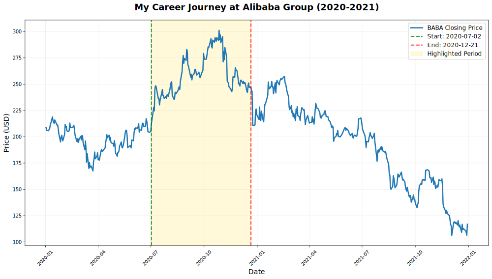
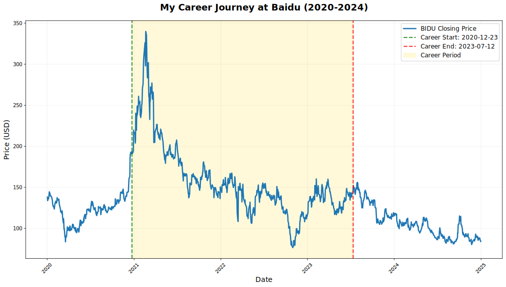
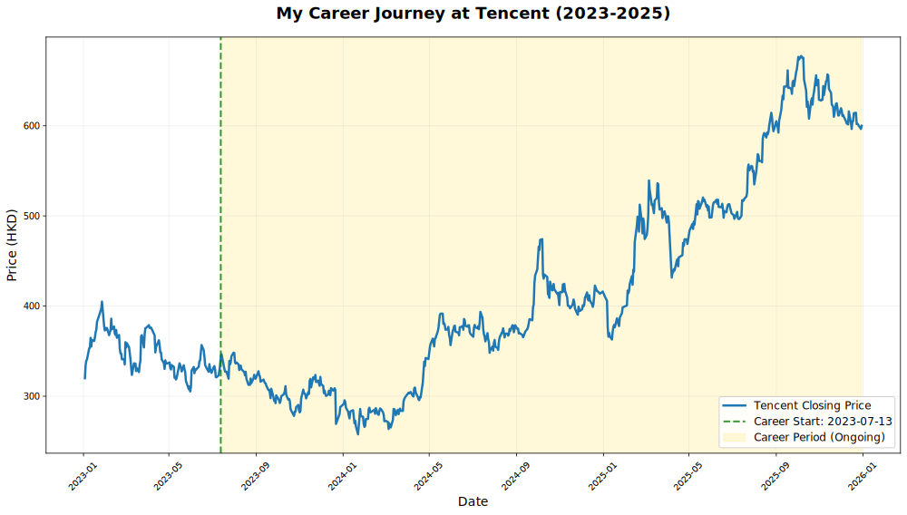

# 👋 Hi, I’m kuizhiqing

### 🏢 Senior Software Engineer at Tencent
Focusing on building reliable and scalable infrastructure for **Large Language Models**. 
Former work in **Alibaba Damo Group** and **Baidu PaddlePaddle Group**. 

### 🎓 PhD in Mathematics
Centrale Marseille — **wavelet specialist**.

### 💻 Large-scale LLM Infrastructure & Frameworks
Focus on **distributed training** and **performance optimization**. 
Contributions to **PyTorch** and **PaddlePaddle**.

### ☁️ Cloud Native Infrastructure & System Design
Active in **Kubernetes** and **Kubeflow** communities.

### 🌐 Languages
English & French speaker, **Chinese native**.

---

## 📈 Career Journey & Stock Performance Analysis

### 🏢 Alibaba (July 2020 - December 2020)
**Role**: Software Engineer at Alibaba Damo Group  
**Stock Performance**: +16.47% during tenure

### 🔍 Baidu (December 2020 - July 2023)
**Role**: Engineer at Baidu PaddlePaddle Group  
**Stock Performance**: -23.03% during tenure

### 🚀 Tencent (July 2023 - Present)
**Role**: Senior Software Engineer focusing on LLM Infrastructure  
**Stock Performance**: +74.52% during ongoing tenure

---

### 🔧 Skills

 

<!--
# GitHub Stats :
 

---

**kuizhiqing/kuizhiqing** is a ✨ _special_ ✨ repository because its `README.md` (this file) appears on your GitHub profile.

 

Here are some ideas to get you started:

- 🔭 I’m currently working on ...
- 🌱 I’m currently learning ...
- 👯 I’m looking to collaborate on ...
- 🤔 I’m looking for help with ...
- 💬 Ask me about ...
- 📫 How to reach me: ...
- 😄 Pronouns: ...
- ⚡ Fun fact: ...
-->
